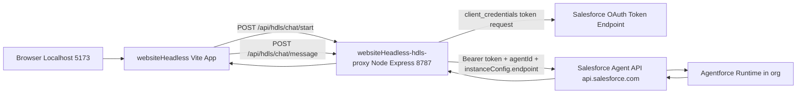

# Agentforce Headless Architecture and Setup

## Purpose

This document explains the current local architecture, all setup steps, and why each item exists for the `websiteHeadless` + `websiteHeadless-hdls-proxy` implementation.

The goal is to run a custom local web chat UI (Vite app) that talks to a Salesforce Agent through the Agent API in a secure way.

## High-Level Architecture

## Components and Why They Are Included

1. **`websiteHeadless` (Vite frontend)**
   - **What it does:** Renders the chat UI and sends chat requests.
   - **Why included:** Provides a custom web experience and decouples UI from Salesforce internals.

2. **`websiteHeadless-hdls-proxy` (Node/Express backend)**
   - **What it does:** Handles OAuth token retrieval and all Agent API calls (`start`, `message`, `end`).
   - **Why included:** Protects `client_id`/`client_secret` and centralizes API orchestration.

3. **Salesforce Connected App (client credentials)**
   - **What it does:** Issues machine-to-machine OAuth tokens.
   - **Why included:** Required for secure server-side authentication to Agent API.

4. **Salesforce Agent (Agent ID `0Xx...`)**
   - **What it does:** Executes conversation logic and returns responses.
   - **Why included:** This is the target conversational agent used by the app.

5. **Agent API base URL (`https://api.salesforce.com`)**
   - **What it does:** Global endpoint for Agent API calls in commercial cloud.
   - **Why included:** Correct API host for non-Gov orgs.

6. **My Domain URL (`https://<my-domain>.sandbox.my.salesforce.com`)**
   - **What it does:** Passed in `instanceConfig.endpoint` when starting sessions.
   - **Why included:** Routes the session context to the correct Salesforce org runtime.

## Local Configuration Inventory

## Frontend (`websiteHeadless/.env`)

- `VITE_HDLS_PROXY_BASE_URL=http://localhost:8787`
  - **Used for:** Frontend base URL to call the local proxy.
  - **Why needed:** Keeps browser calls local and avoids exposing Salesforce auth flows.

- `HDLS_VITE_BASE_PATH=/websiteHeadless/`
  - **Used for:** App base path/routing in local/static hosting scenarios.
  - **Why needed:** Ensures asset and route resolution is consistent.

## Proxy (`websiteHeadless-hdls-proxy/.env`)

- `HDLS_PORT=8787`
  - **Used for:** Proxy server listen port.
  - **Why needed:** Known local endpoint for frontend calls.

- `HDLS_ALLOWED_ORIGIN=http://localhost:5173`
  - **Used for:** CORS allowlist.
  - **Why needed:** Allows local Vite app to call proxy safely.

- `HDLS_SF_LOGIN_URL=https://.../services/oauth2/token`
  - **Used for:** OAuth token POST endpoint.
  - **Why needed:** Fetches bearer token for Agent API.

- `HDLS_SF_CLIENT_ID=<connected_app_client_id>`
  - **Used for:** OAuth client credentials grant.
  - **Why needed:** Authenticates the proxy to Salesforce.

- `HDLS_SF_CLIENT_SECRET=<connected_app_client_secret>`
  - **Used for:** OAuth client credentials grant.
  - **Why needed:** Secret counterpart to client ID.

- `HDLS_SF_AGENT_ID=0Xx...`
  - **Used for:** Session start path placeholder replacement.
  - **Why needed:** Identifies the exact target agent.

- `HDLS_SF_MY_DOMAIN_URL=https://<my-domain>.sandbox.my.salesforce.com`
  - **Used for:** `instanceConfig.endpoint` in session start body.
  - **Why needed:** Binds session runtime to the right org domain.

- `HDLS_SF_AGENT_API_BASE_URL=https://api.salesforce.com`
  - **Used for:** Agent API host.
  - **Why needed:** Correct host for commercial cloud.

- `HDLS_SF_AGENT_API_START_PATH=/einstein/ai-agent/v1/agents/{agentId}/sessions`
  - **Used for:** Start session endpoint path template.
  - **Why needed:** Required to create a session.

- `HDLS_SF_AGENT_API_MESSAGE_PATH=/einstein/ai-agent/v1/sessions/{sessionId}/messages`
  - **Used for:** Message endpoint path template.
  - **Why needed:** Required to continue chat within a session.

## API Flow (Step-by-Step)

1. User opens local app in browser.
2. Frontend calls `POST /api/hdls/chat/start` on proxy.
3. Proxy requests OAuth token using `client_credentials`.
4. Proxy calls Agent API start-session endpoint:
   - Host: `https://api.salesforce.com`
   - Path: `/einstein/ai-agent/v1/agents/{agentId}/sessions`
   - Body includes `instanceConfig.endpoint` and `bypassUser`.
5. Salesforce returns `sessionId`.
6. Frontend sends user messages to `POST /api/hdls/chat/message`.
7. Proxy calls Agent API messages endpoint with `sessionId`.
8. Agent response is returned to frontend and rendered in chat UI.

## Why Proxy Instead of Direct Browser-to-Salesforce

The app could be built in alternative patterns, but this project uses a proxy because:

- **Security:** Prevents exposing connected app secret in browser code.
- **Control:** Centralized request shaping, validation, and future policies.
- **Debugging:** Consistent server logs and error normalization.
- **Extensibility:** Easy to add retries, telemetry, throttling, and guardrails.

## Troubleshooting Checklist

When chat start fails:

1. Confirm `HDLS_SF_LOGIN_URL` and `HDLS_SF_MY_DOMAIN_URL` point to the same org hostname.
2. Confirm connected app credentials are valid (token can be obtained).
3. Confirm `HDLS_SF_AGENT_ID` is correct and active in target org.
4. Confirm commercial host uses `https://api.salesforce.com`.
5. Confirm start/message paths exactly match Agent API v1 format.
6. Confirm local CORS origin matches Vite origin.
7. Confirm no port conflict on `8787`.

## Notes on Error Handling Implemented

The proxy has been updated to preserve downstream Agent API status codes instead of always returning generic `500` errors.

- Example: if Salesforce returns `404` for start session, frontend now receives `404` with the original message.
- Benefit: faster root-cause analysis (invalid agent ID, org mismatch, entitlement, etc.).

## Build and Run Steps

1. Configure both `.env` files (`websiteHeadless/.env`, `websiteHeadless-hdls-proxy/.env`).
2. Start proxy:
   - `cd websiteHeadless-hdls-proxy`
   - `npm install`
   - `npm run dev`
3. Start frontend:
   - `cd websiteHeadless`
   - `npm install`
   - `npm run dev`
4. Open Vite URL and start chat.

## Connected App and Postman Video References

Per project notes, these videos were used:

- Connected App create/test flow: [YouTube video](https://www.youtube.com/watch?v=X4DSijM2lHM&list=PL_iKQycYNX_txeXavtMCvfM0r_ax2sNqc&index=4)
- Postman test flow: [YouTube video](https://www.youtube.com/watch?v=oG5GakTw8rI&list=PL_iKQycYNX_txeXavtMCvfM0r_ax2sNqc&index=5)

